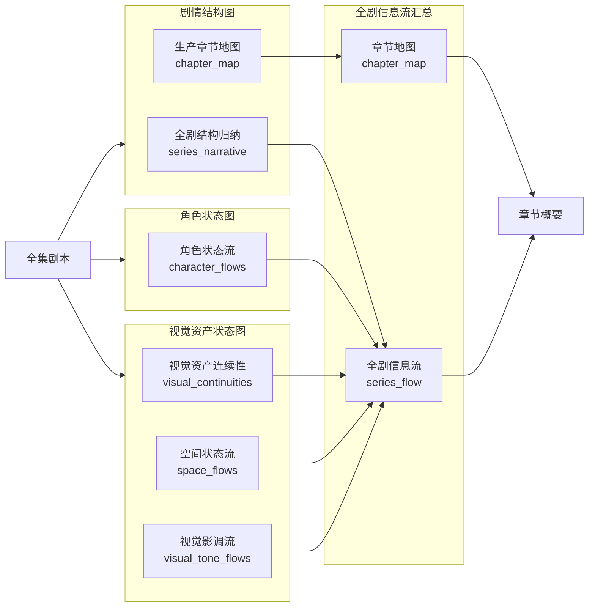
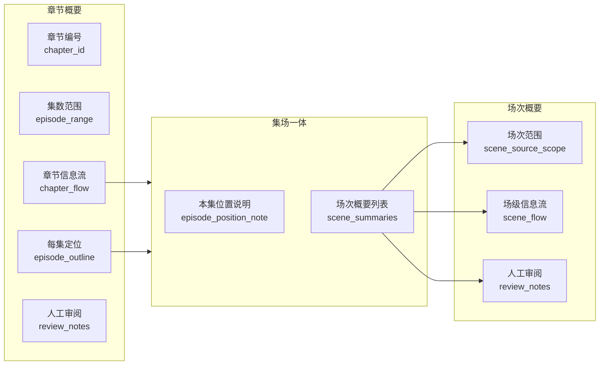
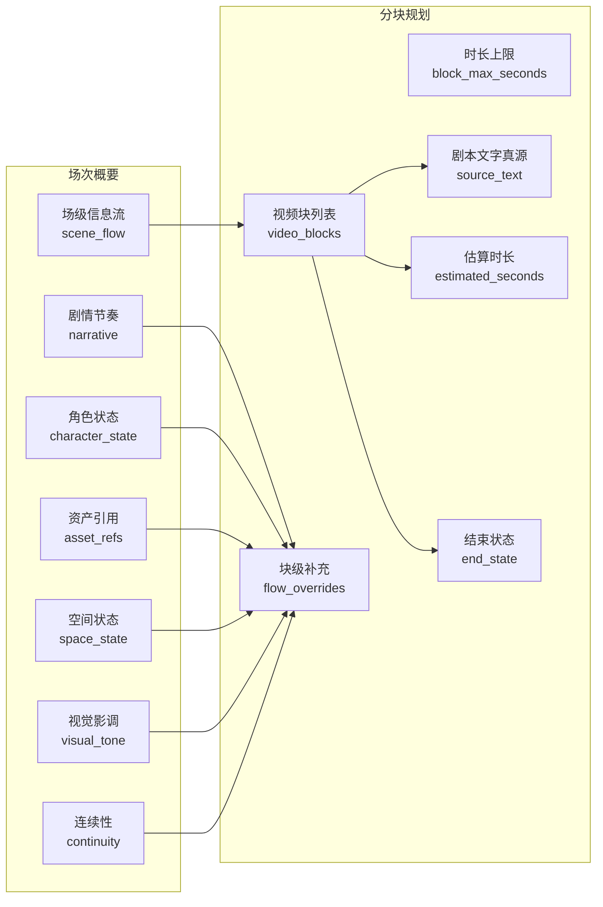
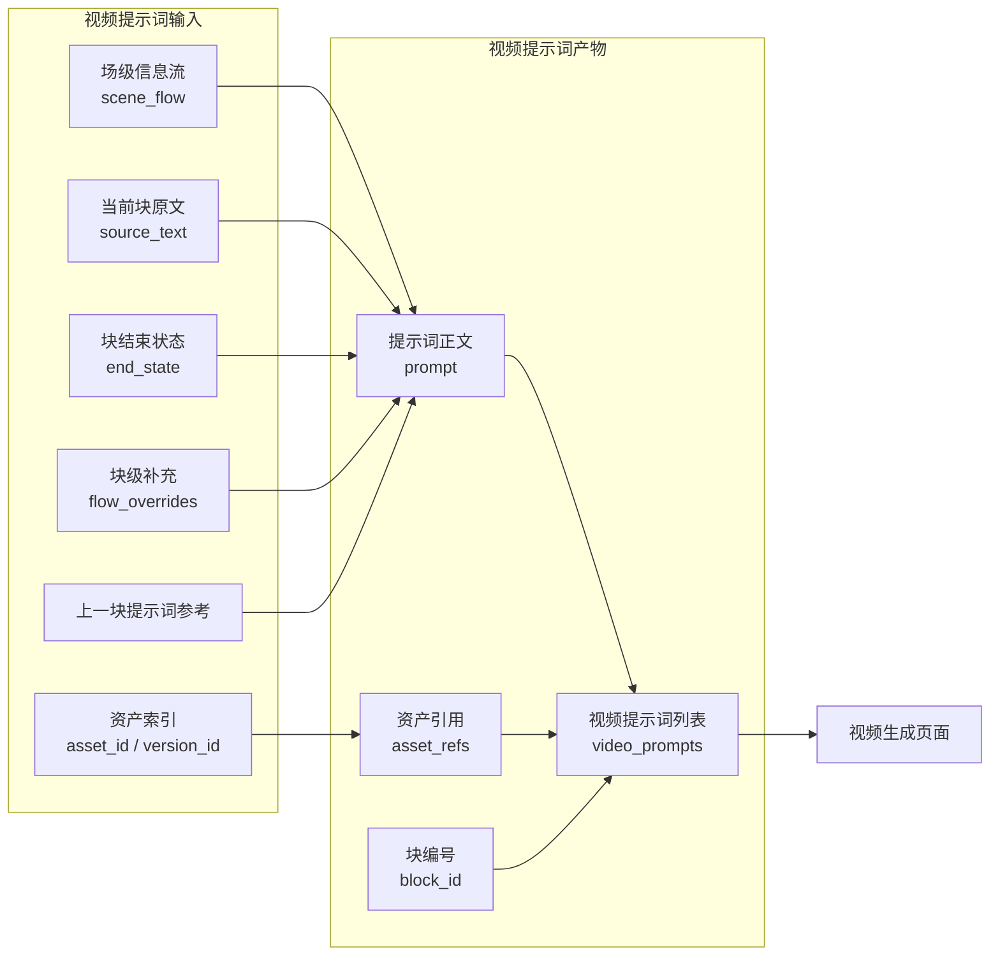
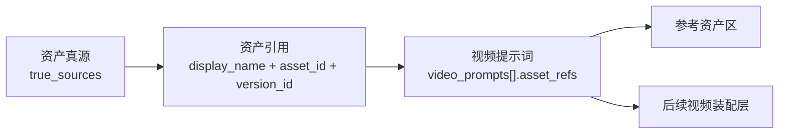

# 分镜工作流字段级图谱

中文名称为主，括号中是技术字段名。

## 1. 全剧到章节

```mermaid
flowchart LR
  script["全集剧本"]

  subgraph map["剧情结构图"]
    sn["全剧结构归纳<br/>series_narrative"]
    cm["生产章节地图<br/>chapter_map"]
  end

  subgraph char["角色状态图"]
    cf["角色状态流<br/>character_flows"]
  end

  subgraph visual["视觉资产状态图"]
    vc["视觉资产连续性<br/>visual_continuities"]
    sf["空间状态流<br/>space_flows"]
    vf["视觉影调流<br/>visual_tone_flows"]
  end

  subgraph series["全剧信息流汇总"]
    flow["全剧信息流<br/>series_flow"]
    chapter_map["章节地图<br/>chapter_map"]
  end

  script --> map
  script --> char
  script --> visual
  sn --> flow
  cf --> flow
  vc --> flow
  sf --> flow
  vf --> flow
  cm --> chapter_map
  chapter_map --> chapter["章节概要"]
  flow --> chapter
```

## 2. 章节到场次

```mermaid
flowchart LR
  subgraph chapter["章节概要"]
    ch_id["章节编号<br/>chapter_id"]
    ch_range["集数范围<br/>episode_range"]
    ch_flow["章节信息流<br/>chapter_flow"]
    ch_outline["每集定位<br/>episode_outline"]
    ch_review["人工审阅<br/>review_notes"]
  end

  subgraph integrated["集场一体"]
    ep_note["本集位置说明<br/>episode_position_note"]
    scene_list["场次概要列表<br/>scene_summaries"]
  end

  subgraph scene["场次概要"]
    sc_scope["场次范围<br/>scene_source_scope"]
    sc_flow["场级信息流<br/>scene_flow"]
    sc_review["人工审阅<br/>review_notes"]
  end

  ch_flow --> integrated
  ch_outline --> integrated
  integrated --> scene_list
  scene_list --> sc_scope
  scene_list --> sc_flow
  scene_list --> sc_review
```

## 3. 场次到分块

```mermaid
flowchart LR
  subgraph scene["场次概要"]
    sc_flow["场级信息流<br/>scene_flow"]
    sc_narrative["剧情节奏<br/>narrative"]
    sc_character["角色状态<br/>character_state"]
    sc_assets["资产引用<br/>asset_refs"]
    sc_space["空间状态<br/>space_state"]
    sc_tone["视觉影调<br/>visual_tone"]
    sc_cont["连续性<br/>continuity"]
  end

  subgraph storyboard["分块规划"]
    max["时长上限<br/>block_max_seconds"]
    blocks["视频块列表<br/>video_blocks"]
    source["剧本文字真源<br/>source_text"]
    seconds["估算时长<br/>estimated_seconds"]
    end_state["结束状态<br/>end_state"]
    overrides["块级补充<br/>flow_overrides"]
  end

  sc_flow --> blocks
  sc_narrative --> overrides
  sc_character --> overrides
  sc_assets --> overrides
  sc_space --> overrides
  sc_tone --> overrides
  sc_cont --> overrides
  blocks --> source
  blocks --> seconds
  blocks --> end_state
```

## 4. 分块到视频提示词

```mermaid
flowchart LR
  subgraph input["视频提示词输入"]
    scene_flow["场级信息流<br/>scene_flow"]
    source["当前块原文<br/>source_text"]
    end_state["块结束状态<br/>end_state"]
    overrides["块级补充<br/>flow_overrides"]
    prev["上一块提示词参考"]
    assets["资产索引<br/>asset_id / version_id"]
  end

  subgraph output["视频提示词产物"]
    prompts["视频提示词列表<br/>video_prompts"]
    block["块编号<br/>block_id"]
    prompt["提示词正文<br/>prompt"]
    refs["资产引用<br/>asset_refs"]
  end

  scene_flow --> prompt
  source --> prompt
  end_state --> prompt
  overrides --> prompt
  prev --> prompt
  assets --> refs
  prompt --> prompts
  refs --> prompts
  block --> prompts
  prompts --> page["视频生成页面"]
```

## 5. 资产引用边界

```mermaid
flowchart LR
  true_sources["资产真源<br/>true_sources"]
  refs["资产引用<br/>display_name + asset_id + version_id"]
  prompt["视频提示词<br/>video_prompts[].asset_refs"]
  page["参考资产区"]
  assembly["后续视频装配层"]

  true_sources --> refs
  refs --> prompt
  prompt --> page
  prompt --> assembly
```

图片路径、图片变体、视频路径不进入视频提示词产物。
